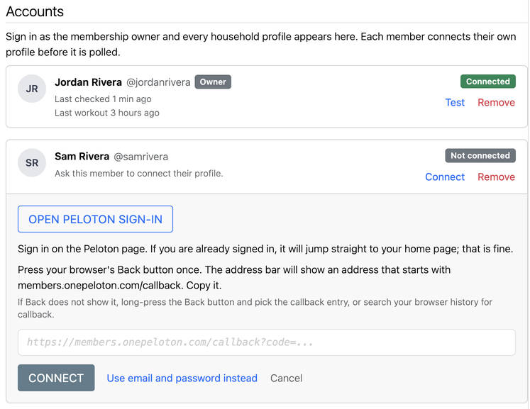
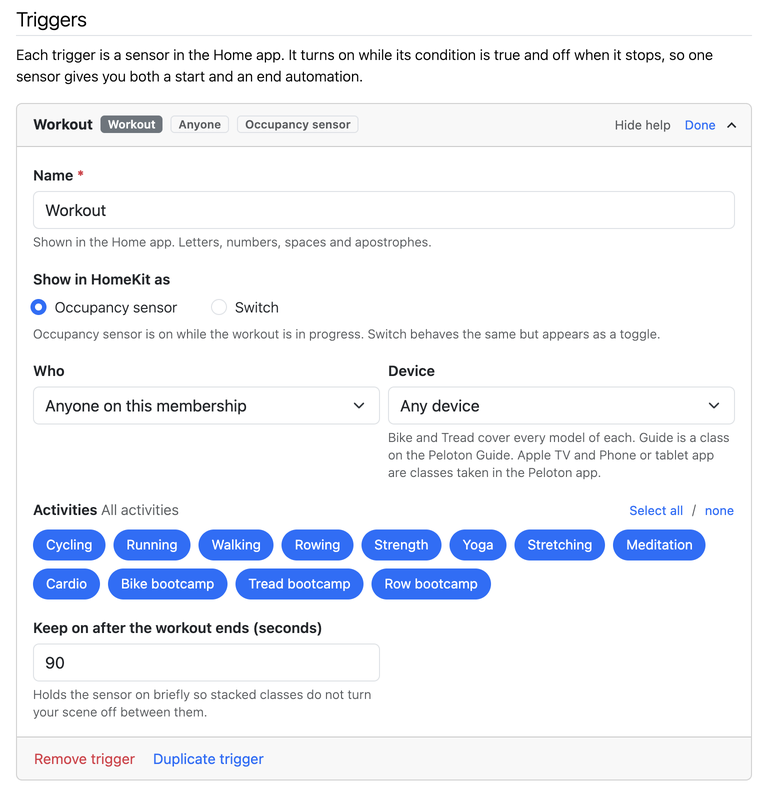
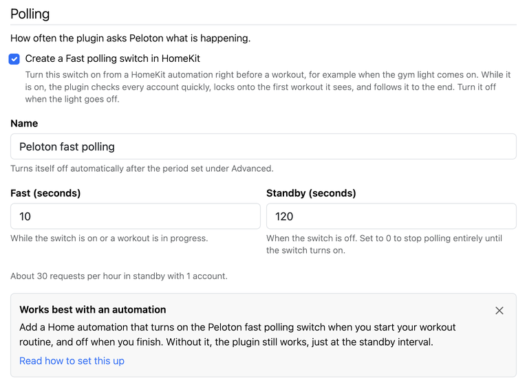
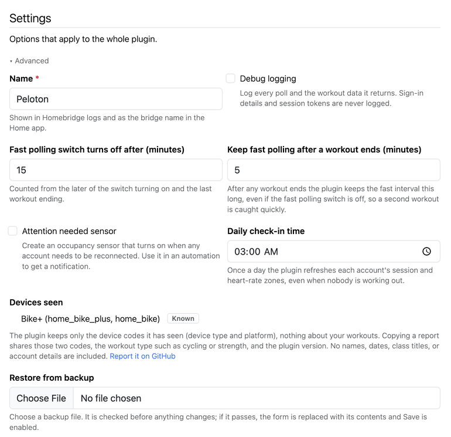

<!--
verified-by-homebridge: this plugin has not been through Homebridge verification yet.
Do not claim it. Once the plugin is verified, replace this comment with the badge:
[](https://github.com/homebridge/homebridge/wiki/Verified-Plugins)
-->

[](https://www.npmjs.com/package/homebridge-peloton)
[](https://www.npmjs.com/package/homebridge-peloton)
[](LICENSE)
[](https://github.com/arodbuilds/homebridge-peloton/actions/workflows/build.yml)

A [Homebridge](https://homebridge.io) plugin that turns Peloton workouts into HomeKit sensors so automations can run when a workout starts or ends. It watches the Peloton accounts in your household and exposes trigger sensors that are on while a workout is in progress: dim the lights when the ride begins, bring them back when the class ends.

Not affiliated with or endorsed by Peloton Interactive. Uses Peloton's undocumented member API, which can change without notice.

> **Status:** stable. 1.0.0 is the first general release.

## Contents

- [Requirements](#requirements)
- [Install](#install)
- [Setup](#setup)
  - [1. Connect your accounts](#1-connect-your-accounts)
  - [2. Add a Workout trigger](#2-add-a-workout-trigger)
  - [3. Set up the fast polling automation](#3-set-up-the-fast-polling-automation)
  - [4. Settings and Advanced](#4-settings-and-advanced)
- [How I use it](#how-i-use-it)
- [Browser sign-in](#browser-sign-in)
- [How it works](#how-it-works)
- [Devices](#devices)
- [Privacy and what is stored where](#privacy-and-what-is-stored-where)
- [Troubleshooting](#troubleshooting)
- [Development](#development)
- [Credits](#credits)
- [License](#license)

## Requirements

- Homebridge 1.8 or 2.x, with the Homebridge UI for the settings page.
- Node 20 or later.
- A Peloton membership. Every profile you want to watch signs in with its own Peloton account.

## Install

Search for "Peloton" under Plugins in the Homebridge UI and install it, or from a shell on the Homebridge host:

```shell
npm install -g homebridge-peloton
```

Then open the plugin's settings from the Plugins page. Everything in the setup below happens on that page. The host's Save button writes config.json and Homebridge restarts the plugin.

## Setup

### 1. Connect your accounts



Under Accounts, enter the email and password of the Peloton account that owns the membership and click Connect. The card flips to Connected, and every profile on the membership appears under it as its own card marked Not connected. A Devices line lists the hardware on the membership with the names from your Peloton account.

Each member connects their own profile before it is polled. Click Connect on the member's card and enter that member's Peloton email and password, or hand them the page. A member who would rather not type a password on the Homebridge host can use Sign in with browser instead, which stores no password (see [Browser sign-in](#browser-sign-in)).

The password is stored in your Homebridge config so the plugin can sign in again by itself if Peloton ever ends the session. The plugin keeps a session token and refreshes it, so signing in again is rare.

### 2. Add a Workout trigger



Under Triggers, click Add trigger. The sensor is on while a matching workout is in progress. Pick who it watches (anyone on the membership, or one member), the device (Any device, Bike, Tread, Guide, Apple TV, or Phone or tablet app; see [Devices](#devices)), and the activities that count; all twelve are selected to start with. Keep on after the workout ends holds the sensor on for a while after the class finishes, 90 seconds by default, so stacked classes do not turn your scene off between them.

Give the trigger a name (it starts as "Workout"), choose Occupancy sensor or Switch as its HomeKit kind, and click Done. Save, restart Homebridge, and the sensor appears in the Home app under the bridge. In Automations, choose the sensor as the trigger and pick what should happen when it turns on and when it turns off.

Heart-rate zone triggers are being refined and are not offered in this release.

### 3. Set up the fast polling automation



The plugin creates a switch called Peloton fast polling. While it is on, the plugin checks every account every 10 seconds, locks onto the first workout it sees, and follows it to the end. While it is off, it polls at the standby interval, 120 seconds by default; 0 turns standby polling off entirely. The switch turns itself off after 120 minutes, counted from the later of turning on and the last workout ending. After any workout ends the plugin keeps checking every 10 seconds for 5 minutes, whether the switch is on or off, so a second workout is caught quickly; both periods are set under Advanced.

Add two Home app automations:

1. When the gym light turns on, turn the Peloton fast polling switch on.
2. When the gym light turns off, turn the Peloton fast polling switch off.

Any trigger that means "a workout is about to start" works in place of the light: a time of day, a motion sensor, a scene. Without the automation the plugin still works, just at the standby interval, so a workout may be noticed up to two minutes after it starts.

### 4. Settings and Advanced



Settings holds one Advanced disclosure, collapsed until something inside it is changed:

- Name: the plugin name, shown in Homebridge logs and as the bridge name in the Home app.
- Debug logging: logs every poll and the workout data it returns; sign-in details and session tokens are never logged.
- Fast polling switch turns off after: the auto-off period in minutes.
- Keep fast polling after a workout ends: how many minutes the plugin keeps the fast interval after any workout ends, even with the switch off, so a second workout is caught quickly. 5 by default, 0 turns it off.
- Attention needed sensor: an occupancy sensor that is on while any account needs to be reconnected, for an automation that sends you a notification.
- Daily check-in time: once a day the plugin refreshes each account's session and heart-rate zones, even when nobody is working out.
- Devices seen: a read-only list of the device codes the plugin has seen on your membership, each tagged Known or Unknown. An Unknown row has a Copy report button; see [Devices](#devices).
- Restore from backup: loads a saved Peloton platform block, a whole config.json, or a saved draft of this page.

## How I use it

My workouts start the same way every time: I turn on the gym light. A Home automation turns on the Peloton fast polling switch when that light comes on, so by the time I have clipped in the plugin is already checking every ten seconds. I do not use an automation to turn the switch off; the "Fast polling switch turns off after" setting under Advanced is set to 15 minutes, so polling winds down on its own after my last workout ends, and back-to-back sessions are caught without a gap.

One Workout trigger set to Any device drives the room: when it turns on, a scene sets the lights and the fan; when it turns off, another scene puts the room back. Because the trigger stays on for the whole workout, one sensor gives me both ends.

For different rooms I use the Device filter: a Bike trigger and a Tread trigger each drive their own scene, and a Phone or tablet app trigger handles classes I take in the living room on the Apple TV or on the iPad. A trigger set to Any device also fires when I start a class on my phone away from home, which is fine for me; if you do not want that, use the device filters instead.

The family each connected their own profile, and a per-person Workout trigger lets each of us have our own scene.

## Browser sign-in

If Peloton does not accept the sign-in from the plugin, or an account has extra verification turned on, the connect panel offers Sign in with browser:

1. Click Open Peloton sign-in. A new tab opens on Peloton's sign-in page. Sign in there. If you are already signed in, it jumps straight to your home page; that is fine.
2. Press your browser's Back button once. The address bar shows an address that starts with members.onepeloton.com/callback. Copy it.
3. Paste it into the field on the settings page and click Connect.

If Back does not show the callback address, long-press the Back button and pick the callback entry, or search your browser history for "callback". The address is single use and expires within minutes. If the page says the link expired or came from an earlier attempt, click Open Peloton sign-in again and use the new one.

## How it works

- **Polling states.** With the Fast polling switch off and no workout in progress the plugin is in standby and polls each account at the standby interval. Switch on, it scans every account at the fast interval. The first account seen with a workout in progress locks the plugin onto that account: only that account is polled, at the fast interval, until the workout ends. Turning the switch off during a workout does not stop the plugin following it to the end.
- **Lock-on.** One workout is followed at a time. Other members' workouts are not polled while a workout is locked, so two riders on one membership should start the second ride after the first has ended, or use one Workout trigger for anyone.
- **Hold.** A Workout sensor stays on for the keep-on time after the class ends, and a new matching workout during that time keeps it on without a gap. A Heart-rate zone sensor changes only after the zone has held for the hold time, and turns off when the workout ends.
- **Third-party imports are ignored.** Runs and other activities synced into Peloton from Apple Health, Strava, or Fitbit never start or end a workout, even when they land at the top of your workout list mid-ride.
- **Fast polling after a workout.** After any workout ends the plugin keeps the fast interval for the minutes set under Advanced (5 by default), whatever the switch, then follows the switch again.
- **Configuration.** The settings page writes the platform block in config.json; the shape and every default are in [SPEC.md](SPEC.md) section 6 and in `config.schema.json`, for anyone who edits by hand.

## Devices

The Device filter on a Workout trigger matches the platform a workout was recorded on. These are the codes the plugin knows, as Peloton reports them:

| Hardware or source | Shown as | device_type | platform | Device filter |
| --- | --- | --- | --- | --- |
| Bike (original) | Bike | home_bike_v1 | home_bike | Bike |
| Bike+ | Bike+ | home_bike_plus | home_bike | Bike |
| Tread | Tread | prism | home_tread | Tread |
| Guide | Guide | t21n8m2 | tiger | Guide |
| Apple TV app | Apple TV | apple_tv | apple_tv | Apple TV |
| iPhone app | iPhone | iPhone | iOS_app | Phone or tablet app |
| iPad app | iPad | iPad | iOS_app | Phone or tablet app |
| Apple Health import | Apple Health import | apple_health | iOS_app | none, imports are ignored |

Every row but the original Bike was observed on a live membership between September 11 and 16, 2026; the original Bike's codes come from public logs. Row and Android: not yet observed; the Devices seen block under Advanced makes a report a copy and paste. An Android app class is expected to match Phone or tablet app once its codes are confirmed.

When the plugin sees a code it does not know it logs one line, "New Peloton device seen", and lists the pair under Advanced, Devices seen, tagged Unknown with a Copy report button. The report holds the two codes, the workout type such as cycling or strength, and the plugin version, nothing else; paste it into a [device report](https://github.com/arodbuilds/homebridge-peloton/issues/new?template=device-report.yml) and the next release can name the device and, for new hardware, give it a filter.

## Privacy and what is stored where

- Session tokens live in `homebridge-peloton/accounts/` inside the Homebridge storage folder, one file per account with mode 0600, readable only by the Homebridge user. They are never written to config.json, the log, or the settings page.
- Passwords are stored in config.json only for accounts connected with email and password on the settings page, so the plugin can sign in again by itself. Accounts connected with Sign in with browser store no password.
- Profile photos are fetched by the plugin and proxied to the settings page; the page never talks to Peloton's servers itself.
- The log never contains tokens, passwords, emails, or Peloton's responses. Debug logging prints workout ids and statuses only.
- The devices seen list keeps only device codes (device type and platform) and the workout type each was first seen on, in the owner's account file. No workout ids, titles, dates, or account details are kept for it.
- To remove everything for an account, click Remove on its card. To remove every stored sign-in, delete the `homebridge-peloton` folder in the Homebridge storage folder.

## Troubleshooting

- **Reconnect needed.** Peloton ended the session (a password change, a sign-out everywhere, or a session that expired). The card shows "Sign-in expired. Reconnect to resume polling." Click Reconnect and sign in again. If the account has a password in config the plugin also tries once by itself at the next start. The Attention needed sensor under Advanced turns on while any account is in this state.
- **Accounts with extra verification.** If Peloton asks for a verification code when the plugin signs in, the panel says so and offers Sign in with browser; complete the verification in the browser tab and paste the callback address. Please open an issue if you hit this, since it has not been seen on a household account yet.
- **"Peloton sign-in did not complete."** Peloton changed something about its login page and the headless sign-in no longer fits it. Use Sign in with browser to keep going, and open an issue with the output of the auth probe (see [Development](#development)); the fix lives in one file.
- **No heart-rate data.** The log says "no heart-rate data for this workout" once per workout when no heart-rate monitor is paired. The zone sensor stays off for that workout.
- **A workout is noticed late.** Without the fast polling automation the plugin polls at the standby interval. Set up the automation, or lower the standby interval under Polling. A second workout soon after the first is caught quickly either way, for the minutes set by Keep fast polling after a workout ends under Advanced.
- **A trigger with a Device filter never turns on.** The workout may come from hardware or an app the plugin does not know yet. Check Devices seen under Advanced: an Unknown row means the codes are new, and Copy report gives you everything a [device report](https://github.com/arodbuilds/homebridge-peloton/issues/new?template=device-report.yml) needs. A trigger set to Any device works meanwhile.

## Development

Node 20 or later. Install with `npm install`, then:

| Script | What it does |
| --- | --- |
| `npm run lint` | ESLint over the source, the settings page, the tests, and the config, zero warnings allowed |
| `npm run build` | Compiles `src/` to `dist/` with TypeScript, including the UI server and the probe |
| `npm test` | Builds, then runs the node:test suites in `test/` against `dist/` and the settings page |

The network is always mocked in tests. Fixtures live under `fixtures/`, sanitised recordings of Peloton's login pages and API answers; see `fixtures/README.md` for what each file stands in for. The settings page is plain HTML, CSS, and ES modules under `homebridge-ui/public/`, served by the Homebridge UI with no build step; it runs on the Homebridge Plugin Shell shared with homebridge-notify-switch (the shell files are listed in [design/README.md](design/README.md)), and its server side is compiled from `src/ui/` and started by `homebridge-ui/server.js`. [SPEC.md](SPEC.md) is the source of truth for behaviour and [design/README.md](design/README.md) for the settings page.

### Auth probe

The probe runs the headless sign-in on its own, without Homebridge, which is the first thing to try when sign-in stops working. Build first, then run from a directory where a token file may be written:

```shell
npm run build
node dist/scripts/auth-probe.mjs login you@example.com        # prompts for the password without echo
node dist/scripts/auth-probe.mjs login you@example.com --dump ./auth-dump
node dist/scripts/auth-probe.mjs refresh
node dist/scripts/auth-probe.mjs browser                       # prints the sign-in URL, waits for the pasted callback URL
node dist/scripts/auth-probe.mjs me
node dist/scripts/auth-probe.mjs workout --keys
node dist/scripts/auth-probe.mjs graph <workoutId>               # metric slugs, sample counts, heart-rate zone bounds
```

Tokens are stored in `./probe-tokens.json` with mode 0600 and are never printed. On failure the probe prints the auth stage and HTTP status only. With `--dump`, every HTML page of the login flow is written to the given directory with form values redacted, which is what to attach to an issue when the flow needs adjusting. Token responses are never written. Delete `probe-tokens.json` and the dump directory when done.

## Credits

The Peloton API is undocumented, and this plugin stands on the work of people who mapped it before. Each project was read for the endpoints and parameters it documents; this plugin shares no code with any of them, and its sign-in flow was written from observation of Peloton's Auth0 login.

- [peloton-to-garmin](https://github.com/philosowaffle/peloton-to-garmin) (GPL-3.0) for the workout and performance graph endpoints.
- The [Home Assistant Peloton integration](https://github.com/edwork/homeassistant-peloton-sensor) (Apache-2.0) for the polling approach and the workout status fields.
- [@dofek/peloton](https://github.com/Asherlc/dofek/tree/main/packages/peloton-client) (MIT) for the research into Peloton's Auth0 sign-in flow.

Built by Alex Rodriguez. If this plugin is useful to you, say hello at [alex-rodriguez.com](https://alex-rodriguez.com/?ref=peloton#building).

## License

Apache-2.0. Copyright 2026 Alex Rodriguez (arodbuilds).
